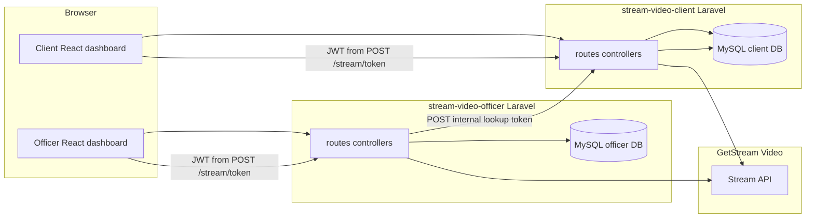

# Stream Video demo: client + officer (two Laravel apps)

Two separate Laravel 11 applications with **Inertia.js + React** and [Stream Video](https://getstream.io/video/). The **client** app registers end users by **phone number** (login with phone + password) and listens for incoming rings. The **officer** app enters the client’s **phone number**; it resolves **phone → Stream `user_id`** via a small server-to-server call to the client app (`CLIENT_APP_URL` + shared `OFFICER_LOOKUP_TOKEN`), then rings and joins the same call.

## Repository layout

| Path | Purpose |
|------|---------|
| [stream-video-client](stream-video-client/) | Client web app (port **8000** in examples) |
| [stream-video-officer](stream-video-officer/) | Officer web app (port **8001** in examples) |
| [stream-sdk-php](stream-sdk-php/) | Shared PHP helpers adapted from [GetStream/stream-video-php-examples](https://github.com/GetStream/stream-video-php-examples) (`StreamIo\` namespace) |
| [_stream-php-ref](_stream-php-ref/) | Optional upstream clone for reference only; safe to delete |

## Technology stack

| Technology | Role in this repo |
|------------|-------------------|
| **Laravel 11** | HTTP server, routing, auth, validation, config, queues/sessions/cache via DB, Artisan commands (`officer:create` on the officer app). |
| **PHP 8.2+** | Runtime; shared **GetStream** helpers live in [`stream-sdk-php`](stream-sdk-php/) as the `StreamIo\` namespace (Composer `psr-4` from each app). |
| **Inertia.js (Laravel adapter)** | Bridges Laravel and React: controllers return `Inertia::render('PageName', $props)` instead of Blade views for app pages; the root document is still a small Blade shell ([`resources/views/app.blade.php`](stream-video-client/resources/views/app.blade.php)). |
| **React 18** | UI in [`resources/js/Pages/**/*.jsx`](stream-video-client/resources/js/Pages/) and shared components under `resources/js/Components/`. |
| **Vite** | Bundles React/JS, dev server + HMR, loads `@vite` entrypoints from the Blade layout. |
| **Laravel Breeze** | Auth scaffolding (login, register on client only, profile, middleware); stack is **Breeze + Inertia + React**. |
| **Ziggy (`@routes`)** | Exposes named Laravel routes to the frontend as `route('name', params)` inside React. |
| **Axios** | Used from React for JSON POSTs (e.g. `POST /stream/token`, Stream token) with CSRF from the meta tag set in Blade/bootstrap. |
| **MySQL (or SQLite)** | Each app has its **own** `.env` and **own** database; there is **no shared users table** between client and officer. |
| **GetStream Video** | Real-time video + server APIs (JWT from your backend, `getOrCreate` + ring). Same **Video app** credentials in both `.env` files. |
| **Firebase JWT (php-jwt)** | Minting user tokens for Stream where the PHP examples use JWT signing. |

## How Laravel and React work together (Inertia)

1. The user requests a URL (e.g. `/dashboard`). **Laravel** runs `routes/web.php`, applies middleware (`web`, `auth`, `verified`, custom `HandleInertiaRequests`), and a route closure or controller returns **`Inertia::render('Dashboard', [...])`**.
2. **Inertia** responds with JSON containing the **page component name** (e.g. `Dashboard`) and **props** (`auth`, `stream`, `i18n`, etc.). Shared props come from [`HandleInertiaRequests`](stream-video-client/app/Http/Middleware/HandleInertiaRequests.php).
3. The browser already loaded **`resources/js/app.jsx`**, which boots **React** and matches the page name to a component under `resources/js/Pages/Dashboard.jsx`.
4. For **mutations**, React can either use **Inertia** (`router.post`, `useForm`) for traditional form posts to Laravel routes, or **Axios** for small JSON APIs (e.g. Stream token) that return data without a full page navigation.
5. **Vite** serves/compiles JS during `npm run dev`; production uses `npm run build` and versioned assets from `public/build`.

So: **Laravel owns routing, auth, secrets, and Stream server calls; React owns the interactive UI**; Inertia keeps them on one “app-shaped” navigation model without you writing a separate REST API for every screen.

## Database structure (per application)

The two apps are **not** linked by foreign keys in SQL. They only meet in the **browser** (two tabs) and on **GetStream** (same Video app, two distinct `stream_user_id` values). The **officer** app also calls the **client** app over HTTP to map **phone → `stream_user_id`**.

### Client app database (`stream_video_client` in examples)

| Table | Purpose |
|-------|---------|
| **`users`** | Clients: `name`, **`phone`** (unique, digits-only), `email` (nullable), `password`, `locale`, **`stream_user_id`** (UUID, unique), timestamps, `email_verified_at`, `remember_token`. |
| **`sessions`** | Session driver when `SESSION_DRIVER=database`. |
| **`cache`**, **`jobs`**, related | Standard Laravel 11 tables for cache/queue if configured. |

Phone is normalized on register/update; **Stream user id** is created at registration and never shown to the officer as an input—officers use **phone** + internal lookup.

### Officer app database (`stream_video_officer` in examples)

| Table | Purpose |
|-------|---------|
| **`users`** | Officers: `name`, `email`, `password`, `locale`, **`stream_user_id`**, timestamps, etc. No `phone` column on officers; officers are created with `php artisan officer:create`. |
| **`sessions`**, **`cache`**, **`jobs`** | Same roles as on the client app. |

### Logical “links” between data (not SQL FKs)

- **Client `users.stream_user_id`** ↔ **Officer `users.stream_user_id`**: both are Stream **user ids** in the **same** Stream Video application; Stream knows them as two participants in a call.
- **Officer form “client phone”** → **HTTP `POST` to client** `/internal/stream-user-id-by-phone` (header `X-Officer-Lookup-Token`) → **client `users.phone`** → response **`stream_user_id`** → officer backend calls Stream `getOrCreate` with officer + that client id.



## Where important code lives

| Concern | Client app | Officer app |
|---------|------------|-------------|
| Routes / pages | [`routes/web.php`](stream-video-client/routes/web.php), [`resources/js/Pages/`](stream-video-client/resources/js/Pages/) | [`routes/web.php`](stream-video-officer/routes/web.php), [`resources/js/Pages/`](stream-video-officer/resources/js/Pages/) |
| Stream token | [`StreamTokenController`](stream-video-client/app/Http/Controllers/StreamTokenController.php) | Same pattern |
| Ring + join | — | [`StreamRingController`](stream-video-officer/app/Http/Controllers/StreamRingController.php), [`ClientStreamLookupService`](stream-video-officer/app/Services/ClientStreamLookupService.php) |
| Phone → id API | [`OfficerClientLookupController`](stream-video-client/app/Http/Controllers/Internal/OfficerClientLookupController.php) | — |
| Active call UI | [`Pages/Video/ActiveCall.jsx`](stream-video-client/resources/js/Pages/Video/ActiveCall.jsx) | Same path in officer app |
| Stream server SDK wrapper | [`App\Services\StreamVideoService`](stream-video-client/app/Services/StreamVideoService.php) | Mirror under officer `app/Services/` |

## Prerequisites

- PHP **8.2+** with extensions: `openssl`, `mbstring`, `pdo`, **`pdo_sqlite`** (or use MySQL in `.env`)
- [Composer](https://getcomposer.org/) (this repo includes `composer.phar` at the root for Windows setups where Composer is not global)
- Node.js **18+** and npm

If `php artisan migrate` fails with **could not find driver** for SQLite, enable `pdo_sqlite` in `php.ini` or switch `DB_CONNECTION` / `DB_*` to MySQL in each app’s `.env`.

## Stream dashboard configuration

In the [Stream dashboard](https://dashboard.getstream.io/) (Video product), copy:

- **API key** → `STREAM_API_KEY` in **both** apps
- **Secret** → `STREAM_API_SECRET` in **both** apps (never expose to the browser; only Laravel reads it)
- **Call type** → usually `default`; override with `STREAM_DEFAULT_CALL_TYPE` if needed

Optional for your own records (not required for the SDK in this demo):

- **Organization id** → `STREAM_ORGANIZATION_ID` (from the URL `/organization/<id>/...`)
- **Application id** → `STREAM_APPLICATION_ID` (from the Apps list or URL when inside an app)

## Setup (each app)

From the repo root:

```powershell
cd "stream-video-client"
copy .env.example .env
C:\php\php.exe ..\composer.phar install
C:\php\php.exe artisan key:generate
# Edit .env: STREAM_* , APP_URL , and a long random OFFICER_LOOKUP_TOKEN (officer .env must use the same token)
C:\php\php.exe artisan migrate
npm install
npm run dev
```

In a second terminal:

```powershell
cd "stream-video-officer"
copy .env.example .env
C:\php\php.exe ..\composer.phar install
C:\php\php.exe artisan key:generate
# Same STREAM_* as the client. Set APP_URL (officer origin), CLIENT_APP_URL (client app base URL, e.g. http://127.0.0.1:8080), and the SAME OFFICER_LOOKUP_TOKEN as on the client.
C:\php\php.exe artisan migrate
npm install
npm run dev
```

Run Laravel on two ports (examples):

```powershell
# Terminal A — client
cd stream-video-client
C:\php\php.exe artisan serve --host=127.0.0.1 --port=8000

# Terminal B — officer
cd stream-video-officer
C:\php\php.exe artisan serve --host=127.0.0.1 --port=8001
```

On Windows, if `composer` is not on your `PATH`, each app includes `composer.bat` that forwards to the root `composer.phar`. Prepend the app folder to `PATH` before running `php artisan breeze:install` in the future.

If you see **419 Page Expired** when logging in, you were likely hitting **two Laravel apps on `127.0.0.1` with the same default session cookie** (browser sends `laravel_session` to every port). Each app’s `.env` sets a unique **`SESSION_COOKIE`** so client and officer do not overwrite each other’s sessions. Also use a **stable URL** (match `APP_URL` to the host/port you open in the browser).

## Demo flow

1. **Client**: **Register** with **phone number** (10–15 digits, spaces/`+` allowed), pick language, open **Dashboard** and leave it open.
2. **Officer**: create an account with `php artisan officer:create officer@example.com YourSecurePassword --name="Officer Name"`. **Log in**, open **Dashboard**, enter the **same phone number** the client used, submit **Ring and join call** (requires `CLIENT_APP_URL` + matching `OFFICER_LOOKUP_TOKEN` on both apps).
3. **Client**: when the officer rings, **Join call** enables — click it to enter the room.

Both sides use a server-minted JWT from `POST /stream/token`. Ringing uses Stream’s server API (`getOrCreate` with `ring: true` and two members), as described in the [ring calls API](https://getstream.io/video/docs/api/ring-calls/).

## PHP / Composer notes

- `composer.json` in each app sets `"platform": { "php": "8.3.99" }` so dependency resolution works on hosts reporting PHP **8.5** where some transitive packages still declare `<8.5`.
- The shared `stream-sdk-php` tree is autoloaded as **`StreamIo\`** from each app via a relative `psr-4` path.

## Security

- Rotate any API secret that was ever pasted into chat or committed to git.
- Use HTTPS and strict CORS in production; this demo assumes local same-origin requests to each app’s own backend.
